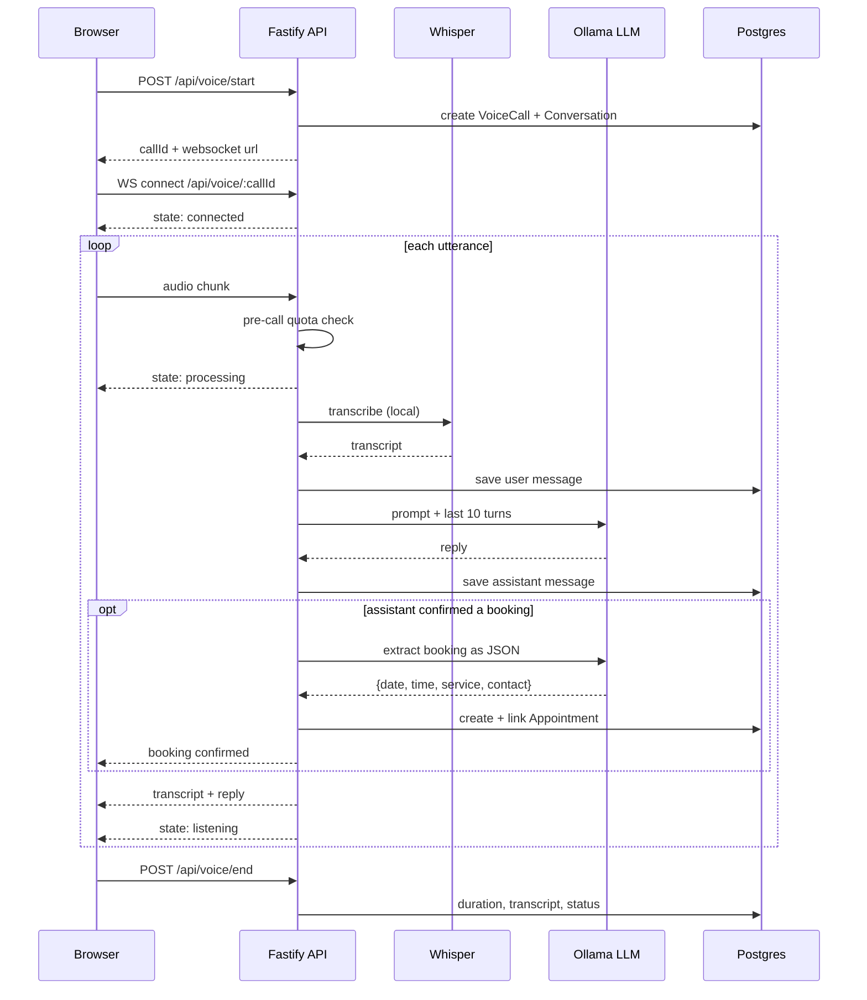

# Voice Booking Agent

A voice AI agent that takes a spoken request and turns it into a booked appointment.

Speech arrives as streamed audio over a WebSocket, gets transcribed by a locally-run Whisper model (transformers.js), and is answered by a locally served LLM that holds the booking conversation across turns. Every call, transcript, and message is persisted in Postgres, so the agent remembers the conversation instead of restarting on each utterance. Nothing calls out to a paid API — the whole pipeline runs on the machine.

> **Status:** personal project, built January to February 2026. It runs end to end locally and is not deployed, has no users, and carries no production traffic. Audio comes from the browser microphone, not a phone network. See [Limitations](#limitations).

---

## How a call works



The socket emits a small state machine the UI renders directly: `connected`, `listening`, `processing`, `muted`, `error`. Conversation context is the last 10 stored messages, replayed into the prompt on every request, which is what lets a caller say "yes, that works" three turns after a time was proposed.

## Reliability and degradation

Both speech-to-text and generation run locally, so there is no per-request bill and no audio leaves the machine. Two properties still matter for a phone-style agent:

- **Graceful degradation.** If the local LLM is unreachable or exceeds `OLLAMA_TIMEOUT_MS` (default 30s), the agent falls back to scripted booking replies rather than dropping the call. A model outage degrades the conversation instead of ending it.
- **Usage tracking.** Minutes and call counts are recorded per day in `whisper_usage` and exposed via `GET /api/voice/quota`.

## Booking agent mode (opt-in)

By default the reply model can say "you're booked" before anything is written. A separate extraction pass then tries to commit the booking, and it quietly gives up if the slot is taken. Setting `BOOKING_AGENT=true` switches the reply to a LangChain tool-calling agent on `qwen2.5:7b-instruct`. It checks real availability and writes the booking through `check_availability` / `book_appointment` tools during the turn. A code-level guard replaces any confirmation the tools did not back, so the caller cannot be told about a booking that does not exist.

It is off by default because each tool call is another model pass on CPU. Measured median turn time was similar (30.3s vs 29.7s), but the spread was wider (up to 53s), and it keeps a second model loaded. Design, decisions and measurements: [`docs/booking-agent-design.md`](docs/booking-agent-design.md).

The usage/quota machinery began as a spend meter for the OpenAI Whisper API. With transcription now local it reports $0 and is retained only as a usage stat — a candidate for removal.

## Also in this repo

The voice agent is the primary system. Two supporting pieces share the codebase:

- **Retrieval service** (`apps/api/src/services/rag.service.ts`) — uploads PDF and DOCX files and answers questions from them with source citations, built from LangChain parts: a recursive text splitter (500/100), `nomic-embed-text` embeddings, a custom `VectorStore` over the Postgres chunk table, and an LCEL retrieval chain. All inference is local, so documents never leave the machine. See [`OLLAMA_RAG_README.md`](OLLAMA_RAG_README.md).
- **Agent CLI** (`agent/`) — a LangChain v1 `createAgent` assistant for exploring a codebase from the terminal. It uses structured tool calling on a local tool-capable model (`qwen2.5:7b-instruct`), keeps conversation memory through a LangGraph checkpointer, confines its tools to one directory, and asks for approval before each file write. Independent of the booking flow. See [`agent/AGENTIC.md`](agent/AGENTIC.md).

## Stack

| Layer | Choice |
|---|---|
| API | Fastify with WebSocket and multipart plugins |
| Language | TypeScript |
| Speech to text | Whisper via transformers.js, run locally (ONNX) |
| Generation and embeddings | Ollama, served locally |
| Audio decode | ffmpeg (bundled via `ffmpeg-static`) |
| Database | Postgres via Prisma |
| Frontend | React and Vite |

Every model runs on the machine: Ollama for generation and embeddings, a local ONNX Whisper for transcription. Inference cost is zero and no transcript, document, or audio clip ever leaves the host. The one-time cost is a model download on first use.

## Data model

Nine Prisma models across three migrations:

- **Voice** — `VoiceCall`, `WhisperUsage`, `WhisperQuota`
- **Conversation** — `Conversation`, `ConversationMessage`
- **Booking** — `Appointment`
- **Retrieval** — `RagDocument`, `RagChunk`, `QueryLog`

## API

```
GET    /health
GET    /api/voice/quota              current month usage and remaining budget
POST   /api/voice/start              open a call, returns callId
POST   /api/voice/end                close a call, persists duration and transcript
WS     /api/voice/:callId            audio in, transcripts and state out

GET    /api/booking/availability     open slots for a date
POST   /api/booking/appointments     create an appointment
GET    /api/booking/appointments     list appointments
POST   /api/booking/chat             text-only booking conversation

POST   /api/rag/upload               ingest a PDF or DOCX
POST   /api/rag/query                ask a question, returns answer and sources
DELETE /api/rag/documents/:fileId    remove a document
```

## Running locally

Requires Node, Postgres, and [Ollama](https://ollama.com).

```bash
ollama serve
ollama pull gemma3
ollama pull nomic-embed-text

cd apps/api
cp .env.example .env          # set DATABASE_URL
npx prisma migrate dev
npm install && npm run dev    # http://localhost:3001

cd ../web
npm install && npm run dev    # http://localhost:8080
```

No API keys are required — every model runs locally. On the first transcription the Whisper model (`WHISPER_MODEL`, default `Xenova/whisper-base.en`) is downloaded from the Hugging Face Hub and cached; ffmpeg is bundled via `ffmpeg-static`, so there is nothing else to install.

`QUICKSTART.md` has a step-by-step walkthrough and `OLLAMA_RAG_README.md` covers the retrieval pipeline.

## Limitations

Worth stating plainly rather than leaving to be discovered:

- **Not a phone system.** Audio is captured from the browser microphone and streamed over a WebSocket. There is no Twilio, SIP, or PSTN integration, so this does not answer real phone calls.
- **Booking commit depends on the model's extraction.** Once the assistant confirms, a second JSON-mode model call extracts the date, time, service, and contact; the result is validated with Zod, dates and times are normalized with chrono and snapped to a real slot, and only then is the appointment written and linked to the conversation (idempotent per conversation). Availability is checked before the write, but the check-then-insert is not atomic, so concurrent commits could still collide. The extracted fields are only as reliable as the model's response. Booking agent mode (above) avoids this by booking through tools inside one transaction, at a latency cost.
- **Availability is simplified.** Open slots are a fixed daily list minus already-booked times. No provider calendars, durations, buffers, or business-hours rules.
- **Single-tenant and unauthenticated.** No accounts, no per-business isolation, no authorization on any route.
- **Not deployed.** Local development only.
