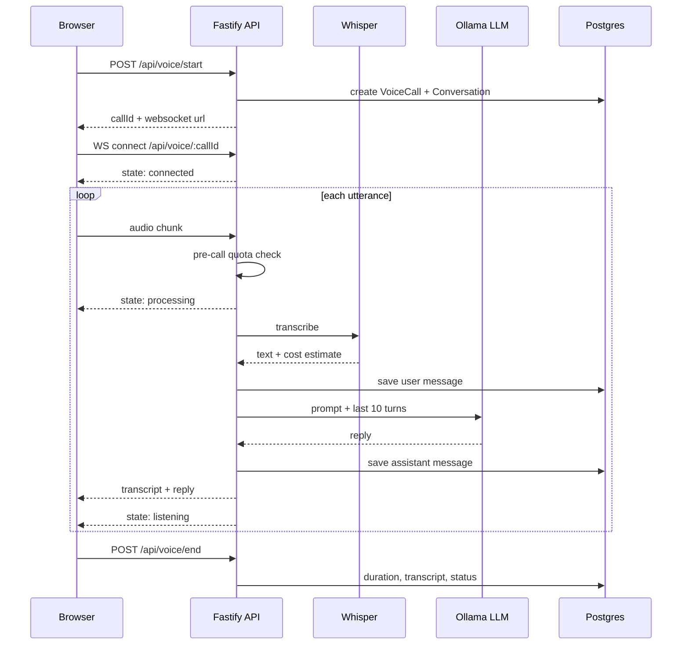

# Voice Booking Agent

A voice AI agent that takes a spoken request and turns it into a booked appointment.

Speech arrives as streamed audio over a WebSocket, gets transcribed by OpenAI Whisper, and is answered by a locally served LLM that holds the booking conversation across turns. Every call, transcript, and message is persisted in Postgres, so the agent remembers the conversation instead of restarting on each utterance.

> **Status:** personal project, built January to February 2026. It runs end to end locally and is not deployed, has no users, and carries no production traffic. Audio comes from the browser microphone, not a phone network. See [Limitations](#limitations).

---

## How a call works



The socket emits a small state machine the UI renders directly: `connected`, `listening`, `processing`, `muted`, `error`. Conversation context is the last 10 stored turns, replayed into the prompt on every request, which is what lets a caller say "yes, that works" three turns after a time was proposed.

## Cost and reliability guardrails

Speech-to-text is the one component here that bills per request, so it is wrapped rather than called directly:

- **Pre-call quota check.** Before any audio is sent to Whisper, the current month's spend is compared against a configurable cap. Over the cap, the call is refused with the remaining budget attached rather than silently charging.
- **Per-call cost estimation.** Cost is estimated from audio duration at the published per-minute rate and checked *before* the request, so a single long clip cannot overshoot the cap.
- **Daily usage tracking.** Minutes, call counts, and estimated cost are upserted per day into `whisper_usage`, making spend queryable via `GET /api/voice/quota`.
- **Graceful degradation.** If the local model is unreachable or times out, the agent falls back to scripted booking replies. A model outage degrades the conversation instead of dropping the call.

The cap defaults to $10/month and is set with `WHISPER_MONTHLY_LIMIT`.

## Also in this repo

The voice agent is the primary system. Two supporting pieces share the codebase:

- **Retrieval service** (`apps/api/src/services/rag.service.ts`) — uploads PDF and DOCX files, chunks them at 500 characters with 100 characters of overlap, embeds each chunk with `nomic-embed-text`, and answers questions by cosine similarity with source citations. All inference is local, so documents never leave the machine.
- **Agent CLI** (`agent/`) — a LangChain think-act-observe loop with filesystem and codebase-analysis tools, used for exploring a project from the terminal. Independent of the booking flow.

## Stack

| Layer | Choice |
|---|---|
| API | Fastify with WebSocket and multipart plugins |
| Language | TypeScript |
| Speech to text | OpenAI Whisper |
| Generation and embeddings | Ollama, served locally |
| Database | Postgres via Prisma |
| Frontend | React and Vite |

Running generation locally through Ollama keeps inference cost at zero and keeps transcripts and uploaded documents on the machine. Whisper is the sole external API call, which is exactly why it is the thing that gets metered.

## Data model

Nine Prisma models across three migrations:

- **Voice** — `VoiceCall`, `WhisperUsage`, `WhisperQuota`
- **Conversation** — `Conversation`, `ConversationMessage`
- **Booking** — `Appointment`
- **Retrieval** — `RagDocument`, `RagChunk`, `QueryLog`

## API

```
GET    /health
GET    /api/voice/quota              current month usage and remaining budget
POST   /api/voice/start              open a call, returns callId
POST   /api/voice/end                close a call, persists duration and transcript
WS     /api/voice/:callId            audio in, transcripts and state out

GET    /api/booking/availability     open slots for a date
POST   /api/booking/appointments     create an appointment
GET    /api/booking/appointments     list appointments
POST   /api/booking/chat             text-only booking conversation

POST   /api/rag/upload               ingest a PDF or DOCX
POST   /api/rag/query                ask a question, returns answer and sources
DELETE /api/rag/documents/:fileId    remove a document
```

## Running locally

Requires Node, Postgres, and [Ollama](https://ollama.com).

```bash
ollama serve
ollama pull gemma3
ollama pull nomic-embed-text

cd apps/api
cp .env.example .env          # set DATABASE_URL and OPENAI_API_KEY
npx prisma migrate dev
npm install && npm run dev    # http://localhost:3001

cd ../web
npm install && npm run dev    # http://localhost:8080
```

`QUICKSTART.md` has a step-by-step walkthrough, `apps/api/WHISPER_SAFEGUARDS.md` documents the cost controls, and `OLLAMA_RAG_README.md` covers the retrieval pipeline.

## Limitations

Worth stating plainly rather than leaving to be discovered:

- **Not a phone system.** Audio is captured from the browser microphone and streamed over a WebSocket. There is no Twilio, SIP, or PSTN integration, so this does not answer real phone calls.
- **Booking dialogue is prompt-driven.** The model is steered by a system prompt and conversation history. There is no tool calling or structured slot filling, so extracted dates and times are only as reliable as the model's free-text response.
- **Availability is simplified.** Open slots are a fixed daily list minus already-booked times. No provider calendars, durations, buffers, or business-hours rules.
- **Single-tenant and unauthenticated.** No accounts, no per-business isolation, no authorization on any route.
- **Not deployed.** Local development only.
